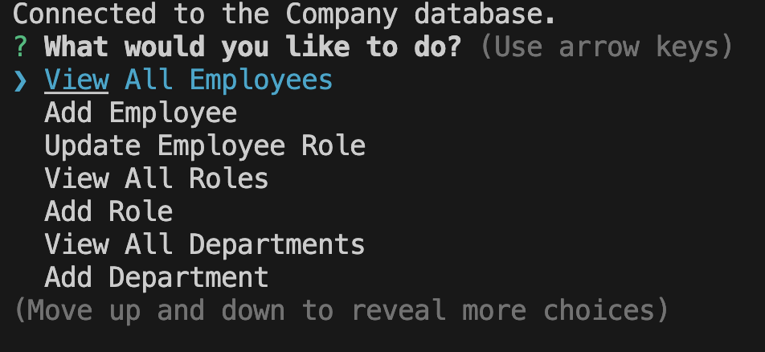
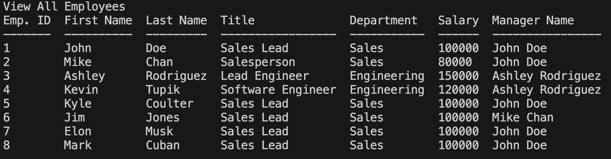
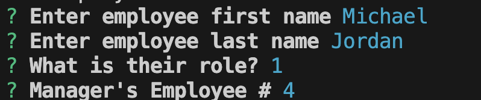

# Company Directory

## Description

This app was designed to quickly and easily keep track of your employee database.

Keeping track of your employees and staying organized is one of the hardest parts of any HR operation. This app allows you to to stay organized and keep track of your employees so that you can focus on the other parts of your business.

By completeing this project I was able to expand on skills I have learned in the coding bootcamp.

## Table of Contents

- [Installation](#Installation)
- [Useage](#Useage)
- [Credits](#Credits)
- [License](#License)
- [Tests](#Tests)
- [Questions](#Questions)

## Installation

Make sure that all of the NPMs are stored locally in the file by running 'npm install". This will allow you to run the program. To run the program, run the command "node index.js".

## Useage

After calling the program, you will be presented with a homepage asking you what you would like to do.

See your Employees, Roles and Departments

Add new employees, roles and departments

You can also update your employees roles!

## Credits

Thank you to my coding class instructors Roger and Sasha for the instruction that allowed me to produce this app.

## License

MIT License

## Tests

https://watch.screencastify.com/v/7Q8PdxBgbzHpHwfRUGn1

## Questions

https://github.com/coulterkyle

For questions regarding this app, contact me at:

e-mail: kcoulter2002@gmail.com
